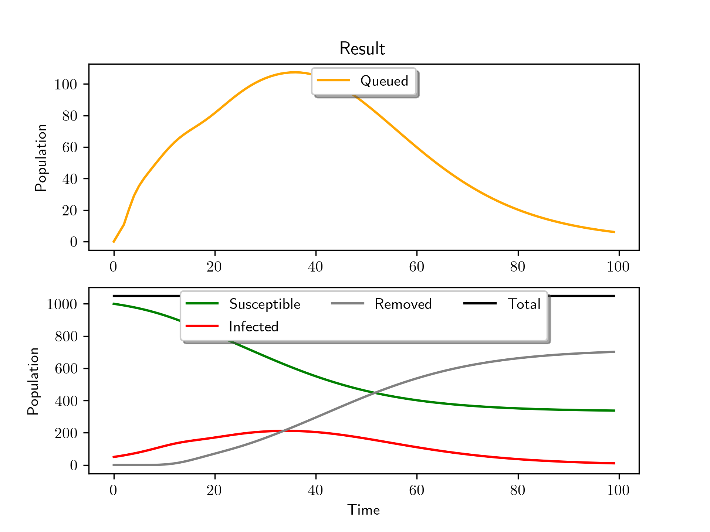
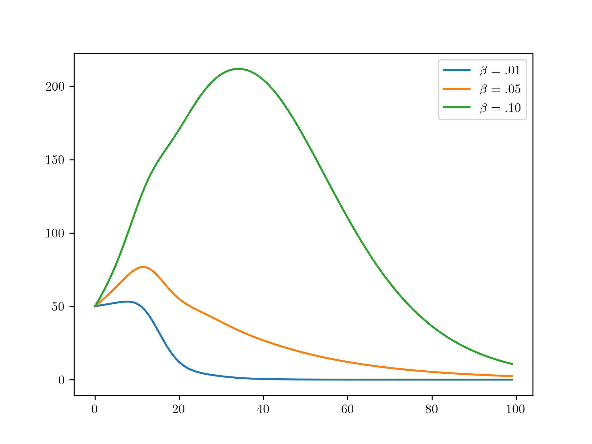

# COVID-19: SIR-model with M|M|s testing-queue
This model strives to simulate the COVID-19 pandemic with testing implemented as a M|M|s-queue.

## Installation

1. [Install Python 3](https://www.python.org/downloads/) 
2. Install dependencies
   - `pip install numpy`
   - `pip install pandas`
   - `pip install matplotblib`
   - `pip install seaborn`
3. Clone or download this repo to your local machine

## Usage

### Simulation example

##### `example_simulation.py`:

```python
from model import Model

model = Model(duration=365, servers=0)
model.run()
model.plot()
```

Generates 



### Analysis example

##### `example_analysis.py`:

```python
from model import Model
import matplotlib.pyplot as plt
import os

model1 = Model(rateSI=0.01)
model1.run()

model2 = Model(rateSI=0.05)
model2.run()

model3 = Model(rateSI=.1)
model3.run()

t = model1.Results['Time']
plt.plot(t, model1.Results['Infected'])
plt.plot(t, model2.Results['Infected'])
plt.plot(t, model3.Results['Infected'])
plt.savefig('example_analysis.png', dpi=300)
```

 