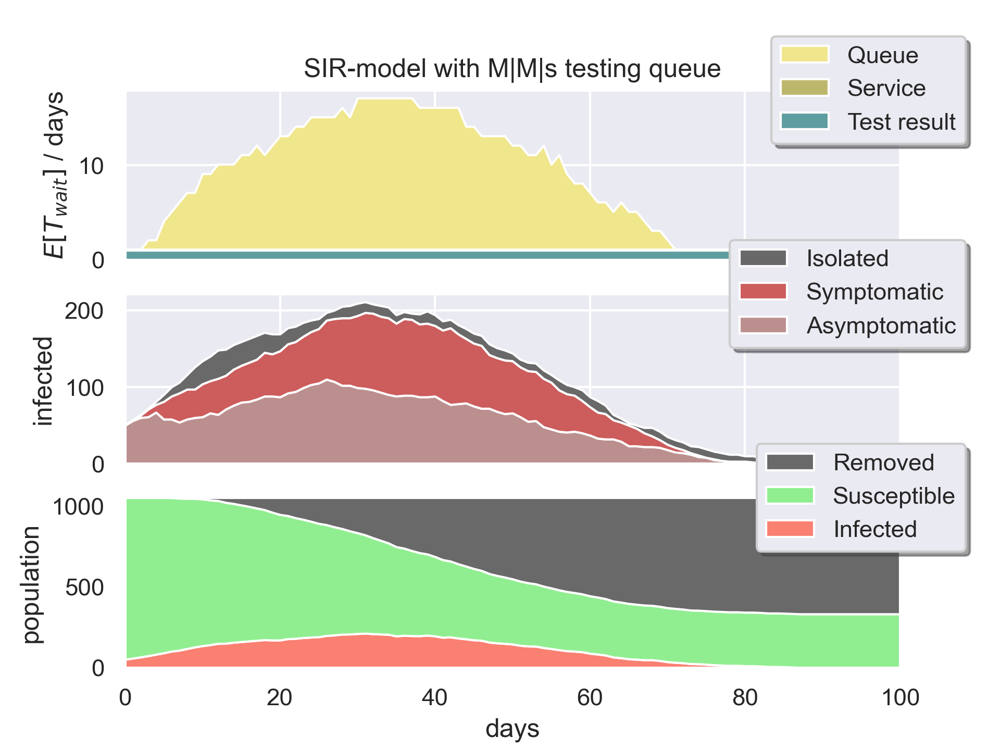

# COVID-19: SIR-model with testing
This model strives to simulate the COVID-19 pandemic with testing implemented as a M|M|s-queue.

When a person shows symptoms he or she is queued for a test. When the queue is empty the person is tested and after a set number of days the test result arrives. At this point the infected individual is isolated. This total time is denoted *Expected Waiting Time* and the purpose of this project is to evaluate how this number affects out control of the pandemic. 

The project is a part of the course *SF2866 Applied Systems Engineering* at *KTH Royal Institute of Science*.

## Installation

1. [Install Python 3](https://www.python.org/downloads/) 
2. Install dependencies
   - `numpy`
   - `pandas`
   - `matplotblib`
   - `seaborn`
3. Clone or download this repo

## Usage

### Simulation example

##### `example_simulation.py`:

```python
from SIR_model import Model

model = Model()
model.run()
model.plot()
```

Generates 



Switching `model.plot()` for `model.queueDistributionPlot()` generates


### Analysis example

##### `example_analysis.py`:

```python
# ------- Import -------
from SIR_model import Model
/.../

# ------- Simulate -------
model1 = Model(servers=1)
model1.run()

model2 = Model(servers=2)
model2.run()

# ------- Plot -------
# /.../
```


### Plot helpers

- The `Model` contains four public plot-helpers:
  - `plotExpectedWaitTime(ax)`
  - `plotQueueDistribution(ax)`
  - `plotInfected(ax)`
  - `plotSIR(ax)`
  
- *Example 1: Only SIR-plot*

  - ```python
    model = SIR_model.Model()
    model.run()
    
    fig, ax = plt.subplots(1, 1)
    model.plotSIR(ax)
    fig.savefig(dpi=300)
    ```
    
  - 
  
- *Example 2: All-plots*

  - ```python
    model = SIR_model.Model()
    model.run()
    
    fig, axs = plt.subplots(2, 2)
    model.plotExpectedWaitTime(axs[0][0])
    model.plotQueueDistribution(axs[0][1])
    model.plotInfected(axs[1][0])
    model.plotSIR(axs[1][1])
    fig.tight_layout()
    fig.savefig(dpi=300)
    ```
  - 


## Method description

### SIR-model

- This implementation uses the [default SIR-implementation](https://en.wikipedia.org/wiki/Compartmental_models_in_epidemiology#The_SIR_model_without_vital_dynamics) for the flow from S to I. However, the differential-equation-flow from I to R is replaced.
- Instead, a person is assumed to recover after a Poisson-distributed number of days.

### Queue-model

- This implementation uses the [default-M|M|s-implementation](https://en.wikipedia.org/wiki/M/M/c_queue) for the death-process. However, the Poisson-birth-process is replaced.
- Instead:
  1. A person is infected accurding to the SIR-model above.
  2. That person shows symptoms after after a Poisson-distributed number of days.
  3. People are placed in the queue the day they start showing symptoms.
     *False symptoms can occur for Susceptibles* 