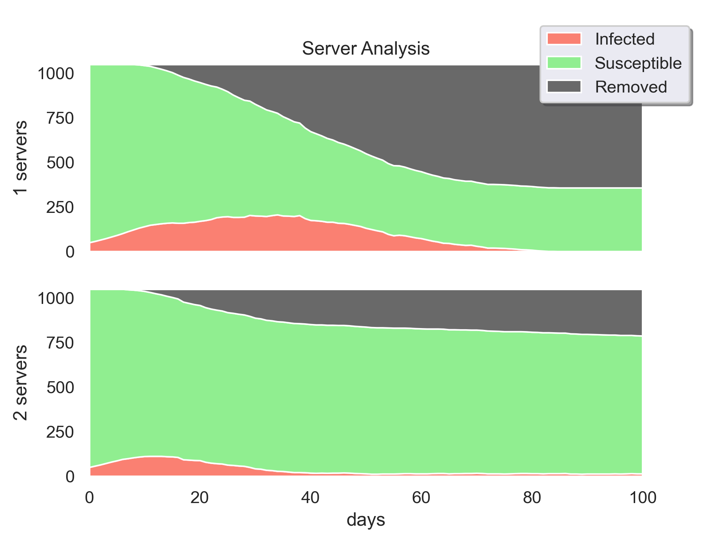

# COVID-19: SIR-model with testing
This model strives to simulate the COVID-19 pandemic with testing implemented as a M|M|s-queue.

## Installation

1. [Install Python 3](https://www.python.org/downloads/) 
2. Install dependencies
   - `numpy`
   - `pandas`
   - `matplotblib`
   - `seaborn`
3. Clone or download this repo

## Usage

### Simulation example

##### `example_simulation.py`:

```python
from SIR_model import Model

model = Model()
model.run()
model.plot('example_simulation.png')
```

Generates 


### Analysis example

##### `example_analysis.py`:

```python
# ------- Import -------
from SIR_model import Model
/.../

# ------- Simulate -------
model1 = Model(servers=1)
model1.run()

model2 = Model(servers=2)
model2.run()

model3 = Model(servers=3)
model3.run()

# ------- Plot -------
# /.../
```

 